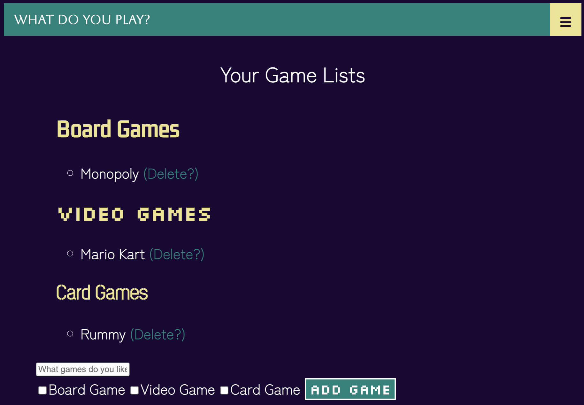

# PoliteCatGroupProject

100Devs small group project using MongoDB, Mongoose, and Passport authentication.

**Link to project:** <https://politecatgroupproject.onrender.com>

## About

The project has a landing page with Login and Signup options. Once a user creates a login credential and successfully logs in, they are routed to the Favorites Page. This is a customized page where the user can add which games they love and see the games they personally have added previously.

Users can easily add their Favorite Game by typing the name in the field that says, “What games do you like?". After they type the name of the game, the user can categorize the game by selecting the checkbox options of Board Games, Video Games, and/or Card Games.

For the user’s convenience there is a navigation bar on top of the page, if the user wants to log out they can select the menu on the top right side of the page and click logout.

## Features

- Login & Signup Page
- Authentication
- Database Structuring (MongoDB)
- Route Verification
- UX/UI- User Optimized Design  
- CRUD
- Express
- EJS Rendering
- Node
